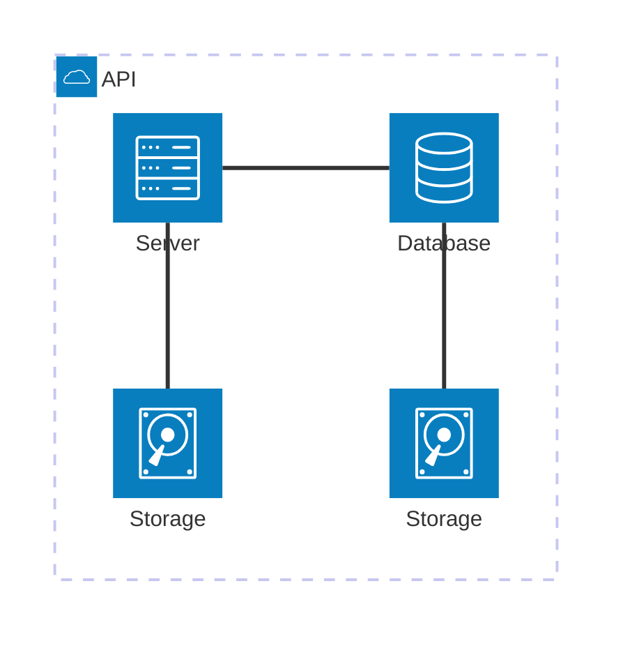

# Homelab

General informations about my homelab/home server.

## Table of contents

- [Apps](apps). List of the apps on my server.

## Hardware

| Component | Product                   |
| --------- | ------------------------- |
| OS        | Proxmox                   |
| CPU       | Intel® Core™ i5-12600K    |
| MOBO      | GIGABYTE B760 Gaming X AX |
| RAM       | 32GB DDR5 6000MHz CL30    |
| Storage   | 2x Seagate IronWolf 8To   |

## Architecture

