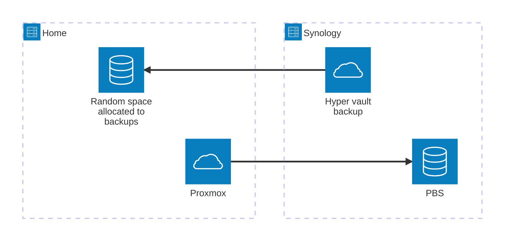

# Backup

## Backup strategy

The pool is "running in RAID0" because I can't be bothered losing storage space or paying more.
The content & all LXCs are backed up to an offsite [PBS](https://proxmox.com/en/products/proxmox-backup-server/overview) everday tho.

The offsite storage is my mom's NAS, which also backups its content to my server each night. Basically one of our home could take a 1000kt bomb and still get our data back.

## Diagram

