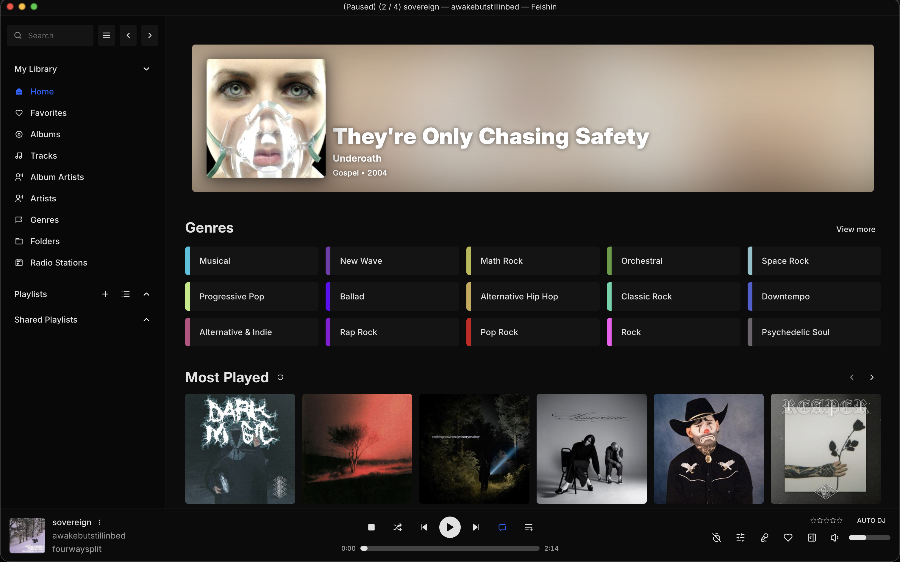

# Navidrome

[Navidrome](https://github.com/navidrome/navidrome) is a self-hosted music streaming service.

_Screenshot is from Feishin, not Navidrome's UI_

## Apps

Depending on the device I use different apps to access Navidrome:

- Android: [Symfonium](https://www.symfonium.app/)
- iOS: [Arpeggi](https://apps.apple.com/us/app/arpeggi/id6503619183)
- Desktop: [Feishin](https://github.com/jeffvli/feishin)
- Web: Navidrome's web app
