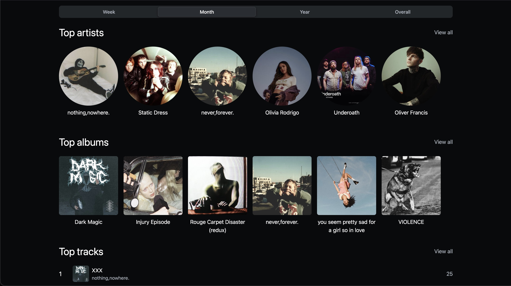

# Yhar

[Yhar](https://github.com/RangoDisco/yhar/) is one of my side projects. It's a scrobbler and a scrobble database. I use it to keep track of my listening habits and visualize the current trends.

You can see a live instance [here](https://stats.nero.rangodisco.eu/users/1/top).

